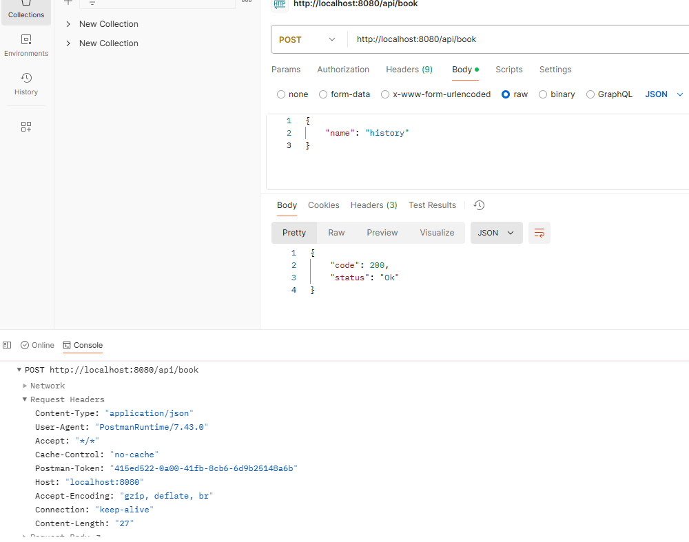
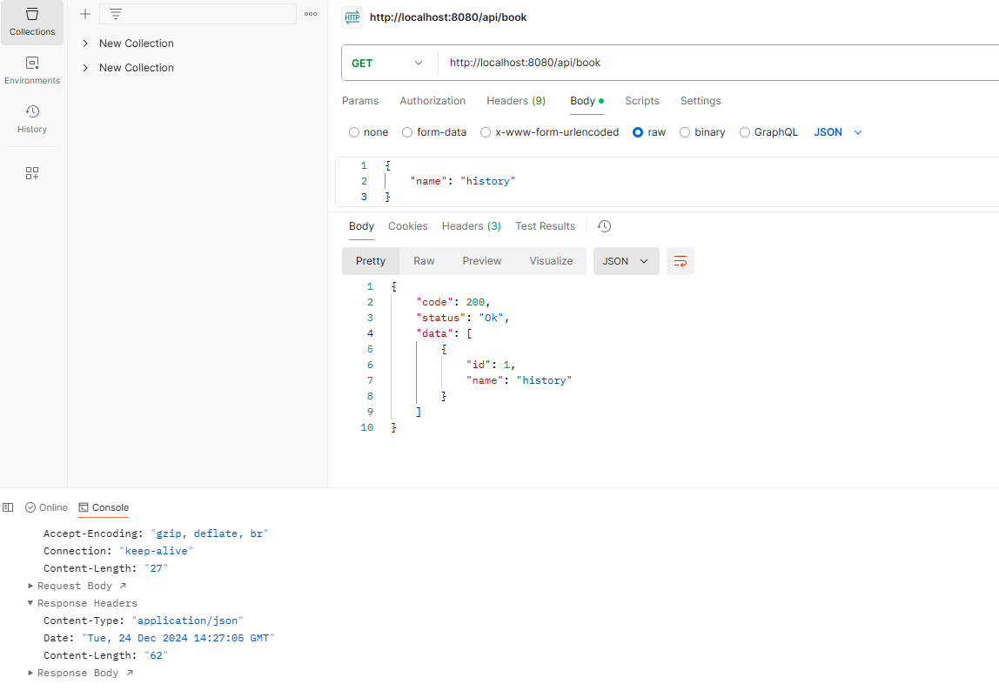

# CRUD Project with PostgreSQL

This project demonstrates a simple CRUD application written in Go, with PostgreSQL as the database. The application allows you to perform basic operations on a `book` table, including creating books and managing them via a RESTful API.

The usage of AI is small, only to produce this README, and to provide me with some edge about technical things.

The main goal of this project is to practice GOLANG, and understand with a project how to use it the best way we can.

## Prerequisites

- Go (version 1.18 or higher)
- PostgreSQL (version 16 or higher)

## Setup and Configuration

### 1. PostgreSQL Configuration

To allow communication between your application and PostgreSQL, you need to configure the PostgreSQL authentication settings.

1. Open the PostgreSQL authentication configuration file:
   ```bash
   sudo vim /etc/postgresql/16/main/pg_hba.conf
   ```

2. Update the configuration to allow local connections:
   ```plaintext
   host    all             all             127.0.0.1/32            md5
   ```
   *(Replace `16` with your PostgreSQL version if necessary.)*

3. Restart the PostgreSQL service:
   ```bash
   sudo systemctl restart postgresql
   ```

### 2. Database Setup

1. Connect to PostgreSQL:
   ```bash
   sudo -u postgres psql
   ```

2. Create a database named `test`:
   ```sql
   CREATE DATABASE test;
   ```

3. Switch to the `test` database:
   ```sql
   \c test
   ```

4. Create the `book` table:
   ```sql
   CREATE TABLE book (
       id SERIAL PRIMARY KEY,
       name VARCHAR(255) NOT NULL
   );
   ```

5. Verify the table structure:
   ```sql
   \d book
   ```

### 3. Running the Application

1. Start the Go application:
   ```bash
   go run main.go
   ```

2. If successful, you should see the following log:
   ```plaintext
   "Start server{"level":"info","time":"2024-12-24T15:24:27+01:00","message":"Connected to database !"}"
   ```

3. Use an API client like Postman to interact with the application.

## Features

- **CRUD Operations**: Perform Create, Read, Update, and Delete operations on the `book` table.
- **RESTful API**: Communicate with the backend using HTTP requests.
- **Concurrency**: Utilize Go routines for handling API requests efficiently.

## Example Requests

Here are examples of API requests you can use via Postman or any HTTP client:

- **Create a Book**:
  - Method: `POST`
  - Endpoint: `/books`
  - Body (JSON):
    ```json
    {
        "name": "Example Book"
    }
    ```




- **Get All Books**:
  - Method: `GET`
  - Endpoint: `/books`




- **Update a Book**:
  - Method: `PUT`
  - Endpoint: `/books/{id}`
  - Body (JSON):
    ```json
    {
        "name": "Updated Book Name"
    }
    ```

- **Delete a Book**:
  - Method: `DELETE`
  - Endpoint: `/books/{id}`

## Notes

- Ensure the database is running and accessible before starting the application.
- API endpoints are designed to be lightweight and efficient, leveraging Go's concurrency model.

## License

This project is open-source and available under the [MIT License](LICENSE).